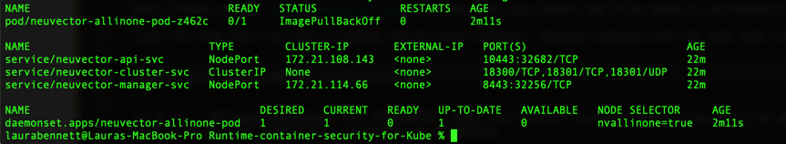
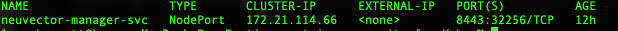

# Complete run-time container security for production Kubernetes workloads

This tutorial demonstrates how NeuVector integrates with IBM Cloud Container Service to provide complete run-time container security for your production Kubernetes workloads. We are excited to partner together to demonstrate how quickly and easily users can deploy a Kubernetes cluster in IBM Cloud and then secure those workloads in this new and ever-changing container and microservice world.

## Why container security is critical

xxxxxxxxx
xxxxxxx
xxxx

## About IBM Cloud

IBM Cloud provides users with a variety of compute choices as well as over 170 IBM and third party services. [IBM Cloud Container Service](https://www.ibm.com/cloud/kubernetes-service?cm_mmc=OSocial_Blog-_-Cloud_Cloud+Platform-_-WW_WW-_-NeuVector&cm_mmca1=000023UA&cm_mmca2=10002833&) combines Docker and Kubernetes to deliver powerful tools, an intuitive user experience, and built-in security and isolation to enable rapid delivery of applications all while leveraging Cloud Services including cognitive capabilities from Watson.

## About NeuVector

[NeuVector](https://neuvector.com/) is cloud-native container firewall for monitoring and protecting Kubernetes container deployments in production. You can download a container firewall article  [here](https://blog.neuvector.com/article/how-to-deploy-a-docker-container-firewall) to learn about how a container firewall differs from traditional next generation firewalls (NGFW) and web application firewalls (WAF).  In addition to Layer 7 network firewall protection of Kubernetes pods, the NeuVector security solution provides features for auditing your security settings with Docker Bench and the Kubernetes CIS benchmark as well as scanning containers for vulnerabilities. NeuVector also monitors host and container processes for suspicious activity such as privilege escalations, port scanning, reverse shells and other unusual syscall activity.

The NeuVector solution is comprised of security containers which can be deployed on each node just like you deploy your applications, using Kubernetes. For evaluation purposes, NeuVector makes available an Allinone container and an Enforcer container. These can be pulled from Docker Hub along with documentation by requesting access from info@neuvector.com.

## Prerequisites

To complete this tutorial,  you will need the following environment:

* IBM Cloud Account

* CLI Tool

* Kubernetes Service Plug-in

## Estimated Time

After the prerequistes are met, this tutorial should take you approximately 30 minutes to complete.

## Steps

1. [Instantiate a Kubernetes cluster in IBM Cloud](#step-1-instantiate-a-kubernetes-cluster-in-ibm-cloud)
2. [Deploy NeuVector onto the cluster](#step-2-deploy-neuvector-onto-the-cluster)
3. [Generate test traffic by running sample applications](#step-3-generate-test-traffic-by-running-sample-applications)

### Step 1. Instantiate a Kubernetes cluster in IBM Cloud

Log into your IBM Cloud account. Select **Kubernetes** on the left-hand navigation.

You will see the following screen presented:

Select `Create a Cluster`

We are going to create a standard cluster below. You can still deploy NeuVector to a lite (free) cluster. If you choose the `Free` version, you only have to set the `Resource name` parameter.

To create a standard cluster, set the following parameters:

* Pricing plan: choose either Standard or Free. (Choose Free)

* Kubernetes version: Current version is 1.18.15

* Infrastructure: Choose Classic or VPC (Choose Classic)

* Location: Select `default`

* Worker Pool: Set up the number of worker nodes for your workload. This can be resized. Leave at default of 4.

* Resource details: Enter Cluster name

Select `Create`

See the [IBM Cloud documentation](https://cloud.ibm.com/docs/containers/cs_planning.html?cm_mc_uid=50290709454116005443693&cm_mc_sid_50200000=12098621611523253320&_ga=2.138338864.1628241841.1611348565-298213949.1607018563&_gac=1.49184468.1609798399.Cj0KCQiAlsv_BRDtARIsAHMGVSZ2x_qOumI9BPMJP2_AteZG4TZroSvFrMZeh4Z28JEBCOB3gpOo6EIaAhvvEALw_wcB#cs_planning) for more details on the cluster creation.

You can also create a cluster from the command line, use the following command:

``
bx cs cluster-create -name -location -workers 2 -machine-type u1cx2x4 -hardware shared -public-vlan -private-vlan
``

### Step 2. Deploy NeuVector onto the cluster

Now that the environment is provisioned, you can access it from the IBM Cloud CLI. Download the CLI tool and login to your cluster following the instructions in the Access tab. Enter the following command:

`curl -sL https://ibm.biz/idt-installer | bash`

Follow the instructions on the screen to 

1. Log into your cluster

2. Set the Kubernetes context to your cluster

3. Verify that you can connect to your cluster

Create the namespace for NeuVector. Enter the following command:

``
kubectl create namespace neuvector
``

You should get a response of `` namepsace/neuvector created``

Next, create a secret for pulling the NeuVector container from Docker Hub, filling in your Docker UserID, Docker password and Docker email:

``
kubectl create secret docker-registry regsecret -n neuvector --docker-server=https://index.docker.io/v1/ --docker-username="<docker id>" --docker-password="<pwd>" --docker-email="<email>"
``

Where ’username’ is your Docker username, ’pwd’ is your Docker password, ’email’ is your Docker email.

You should get a response `secret/regsecret created`

Note: Please contact support@neuvector.com to request that your Docker Hub ID be added to the NeuVector private registry.

Label the node where you want to deploy the Allinone container. Replace nodename with the node name from `kubectl get nodes`:

``
kubectl label nodes nodename nvallinone=true
``

As an fyi, `Allinone containers` are XXXXXXXXXX.  Note, the Enforcer container will automatically be deployed on other nodes in your cluster.
Read up on Allinone and Enforcer containers at XXXXXXXXXX

You will use the ./allinone.yaml file to deploy NeuVector.  Running the following command will create the NeuVector service and pod.

``
kubectl create –f allinone.yaml
``

You should get the following response:

``
clusterrolebinding.rbac.authorization.k8s.io/neuvector-binding created
service/neuvector-manager-svc created
service/neuvector-api-svc created
service/neuvector-cluster-svc created
daemonset.apps/neuvector-allinone-pod created
``

Verify that everything is running

``
kubectl get all -n neuvector
``

You should see the following response

### Step 3. Generate test traffic by running sample applications

If you haven’t already deployed some sample applications, now is a good time to do that so that you’ll be able to see application containers running and their connections in NeuVector.

After generating test traffic through your sample apps, log into the NeuVector console. You’ll need to login the public IP address of your cluster / node, using the random port assigned by the Kubernetes NodePort service. To find that port:

``
kubectl get svc -n neuvector
``

The output will look like this:

BTW - you can also detect the TCP port number of the NeuVector Manager direction using the following command:

``
kubectl get svc/neuvector-manager-svc -n neuvector
``

This command outputs:

You can now login to the NeuVector Manager console (WebUI) using the public IP address and port and ‘admin’ / ‘admin’ to login.

Open your favorite web browser by entering:

``
$ open https://localhost:32256  **Note port in graphic above**
``

BTW - you can also detect the TCP port number of the NeuVector Manager direction using the following command:

``
kubectl get svc/neuvector-manager-svc -n neuvector
``

Feel free to browse the console, view Network Activity, the Policy Rules and other Resources.

## Conclusion

IBM Cloud Container Service makes it easy to set up a Kubernetes cluster to host your containerized applications. When running such applications in production, security is required to ensure that applications are safe and communicating properly. NeuVector provides that run-time security in any cloud environment, providing a layer-7 firewall, host and container processes monitoring, and vulnerability scanning solution.  You can request a demo and access to the download by contacting NeuVector at info@neuvector.com.

Try [IBM Cloud Container Service](https://www.ibm.com/cloud/kubernetes-service?cm_mmc=OSocial_Blog-_-Cloud_Cloud+Platform-_-WW_WW-_-NeuVector&cm_mmca1=000023UA&cm_mmca2=10002833&) and [NeuVector](https://go.neuvector.com/tryse) today!!

