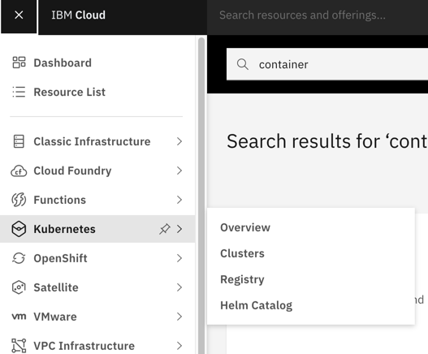
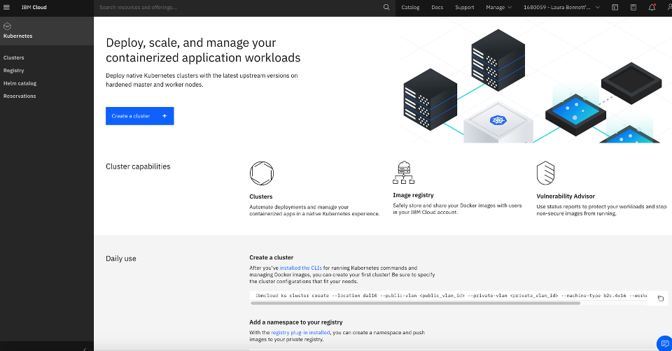
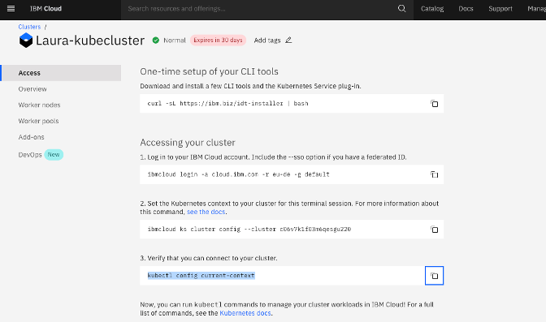
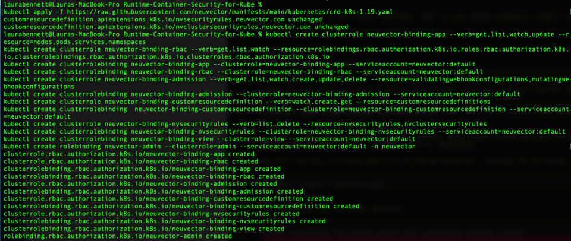
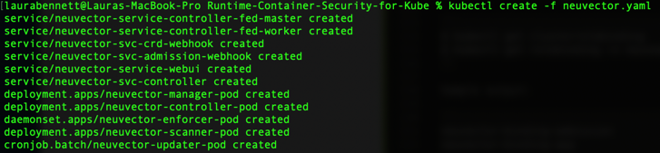
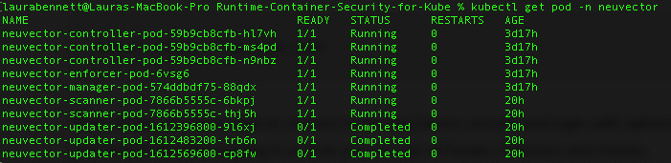
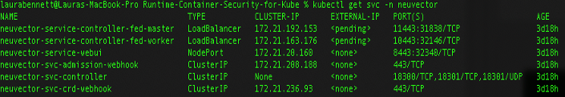
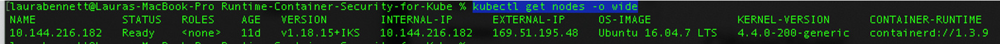
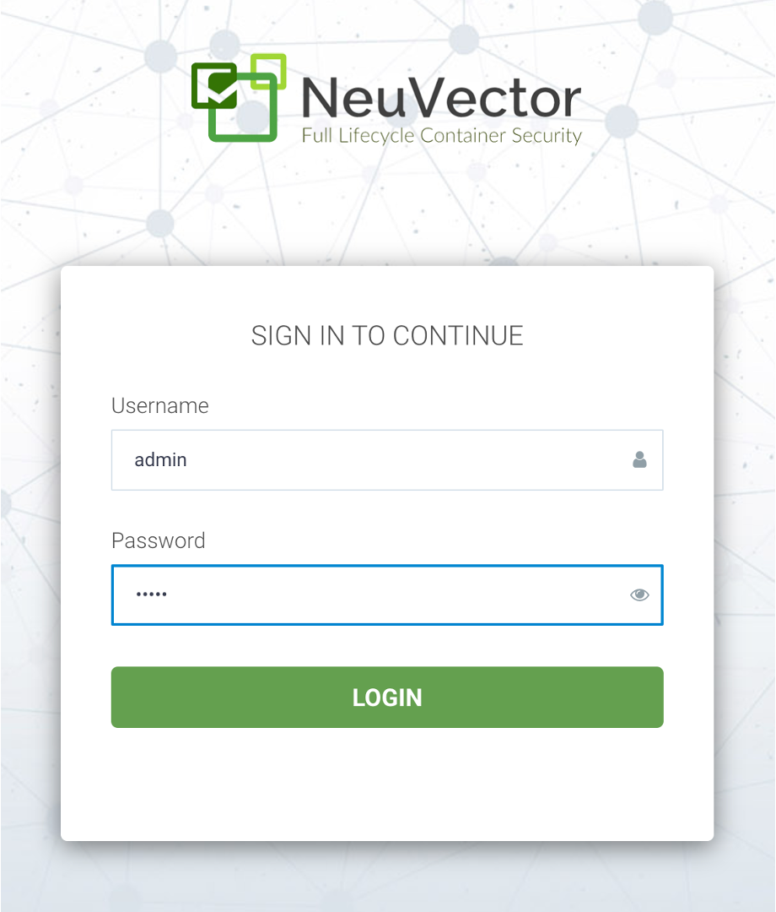
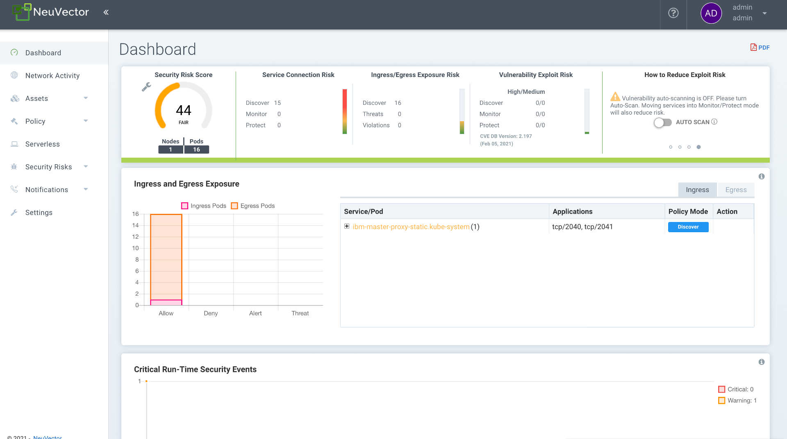

# Complete run-time container security for production Kubernetes workloads


This tutorial demonstrates how NeuVector integrates with IBM Cloud Container Service to provide complete run-time container security for your production Kubernetes workloads. We are excited to partner together to demonstrate how quickly and easily users can deploy a Kubernetes cluster in IBM Cloud and then secure those workloads in this new and ever-changing container and microservice world.

## Why container security is critical

Containers technology makes it easy to deploy applications in the cloud. Kubernetes is one of the popular choices for deploying containerized applications. Vulnerabilities in applications residing within a container can be exploited if the right protections are not in place. This tutorial will guide developers to use NeuVector to monitor their containers for vulnerabilities. 

## About IBM Cloud

IBM Cloud provides users with a variety of compute choices as well as over 170 IBM and third party services. [IBM Cloud Container Service](https://www.ibm.com/cloud/kubernetes-service?cm_mmc=OSocial_Blog-_-Cloud_Cloud+Platform-_-WW_WW-_-NeuVector&cm_mmca1=000023UA&cm_mmca2=10002833&) combines Docker and Kubernetes to deliver powerful tools, an intuitive user experience, and built-in security and isolation to enable rapid delivery of applications all while leveraging Cloud Services including cognitive capabilities from Watson.

## About NeuVector

[NeuVector](https://neuvector.com/) is cloud-native container firewall for monitoring and protecting Kubernetes container deployments in production. You can download a container firewall article  [here](https://blog.neuvector.com/article/how-to-deploy-a-docker-container-firewall) to learn about how a container firewall differs from traditional next generation firewalls (NGFW) and web application firewalls (WAF).  In addition to Layer 7 network firewall protection of Kubernetes pods, the NeuVector security solution provides features for auditing your security settings with Docker Bench and the Kubernetes CIS benchmark as well as scanning containers for vulnerabilities. NeuVector also monitors host and container processes for suspicious activity such as privilege escalations, port scanning, reverse shells and other unusual syscall activity.

The NeuVector solution is comprised of security containers which can be deployed on each node just like you deploy your applications, using Kubernetes. For evaluation purposes, NeuVector makes available an Allinone container and an Enforcer container. These can be pulled from Docker Hub along with documentation by requesting access from info@neuvector.com.

## Prerequisites

To complete this tutorial,  you will need the following environment:

* IBM Cloud Account

* CLI Tool

* Kubernetes Service Plug-in

## Estimated Time

After the prerequistes are met, this tutorial should take you approximately 30 minutes to complete.

## Steps

1. [Instantiate a Kubernetes cluster in IBM Cloud](#1-instantiate-a-kubernetes-cluster-in-ibm-cloud)
2. [Deploy NeuVector onto the Kubernetes cluster](#2-deploy-neuvector-onto-the-Kubernetes-cluster)
3. [Generate test traffic by running sample applications](#3-generate-test-traffic-by-running-sample-applications)
4. [Log into the NeuVector console.](#4-log-into-the-neuvector-console.)


### 1. Instantiate a Kubernetes cluster in IBM Cloud

Log into your IBM Cloud account. Select **Kubernetes** on the left-hand navigation.



You will see the following screen presented:



Select `Create a Cluster`

We are going to create a standard cluster below. You can still deploy NeuVector to a lite (free) cluster. If you choose the `Free` version, you only have to set the `Resource name` parameter.


To create a standard cluster, set the following parameters:

* Pricing plan: choose either Standard or Free. (Choose Free)

* Kubernetes version: Current version is 1.18.15

* Infrastructure: Choose Classic or VPC (Choose Classic)

* Location: Select `default`

* Worker Pool: Set up the number of worker nodes for your workload. This can be resized. Leave at default of 4.

* Resource details: Enter Cluster name

Select `Create`


See the [IBM Cloud documentation](https://cloud.ibm.com/docs/containers/cs_planning.html?cm_mc_uid=50290709454116005443693&cm_mc_sid_50200000=12098621611523253320&_ga=2.138338864.1628241841.1611348565-298213949.1607018563&_gac=1.49184468.1609798399.Cj0KCQiAlsv_BRDtARIsAHMGVSZ2x_qOumI9BPMJP2_AteZG4TZroSvFrMZeh4Z28JEBCOB3gpOo6EIaAhvvEALw_wcB#cs_planning) for more details on the cluster creation.

You can also create a cluster from the command line, use the following command:

```
$ bx cs cluster-create -name -location -workers 2 -machine-type u1cx2x4 -hardware shared -public-vlan -private-vlan
```

### 2. Deploy NeuVector onto the Kubernetes cluster

Now that the environment is provisioned, you can access it from the IBM Cloud CLI. Download the CLI tool and login to your cluster following the instructions in the Access tab. Enter the following command:

```
$ curl -sL https://ibm.biz/idt-installer | bash
```



Follow the instructions on the screen to 

1. Log into your cluster

2. Set the Kubernetes context to your cluster

3. Verify that you can connect to your cluster


4. Create the namespace for NeuVector. Enter the following command:

```
$ kubectl create namespace neuvector
```

You should get a response of ```namepsace/neuvector created```


5. Configure Kubernetes to pull from the private NeuVector registry on Docker Hub. You do this by creating a secret:

```
$ kubectl create secret docker-registry regsecret -n neuvector --docker-server=https://index.docker.io/v1/ --docker-username="<docker id>" --docker-password="<pwd>" --docker-email="<email>"
```

Where ’username’ is your Docker username, ’pwd’ is your Docker password, ’email’ is your Docker email.

You should get a response `secret/regsecret created`

Note: Please contact support@neuvector.com to request that your Docker Hub ID be added to the NeuVector private registry.


6. Create the custom resources (CRD) for NeuVector security rules

For Kubernetes 1.19+:

```
$ kubectl apply -f https://raw.githubusercontent.com/neuvector/manifests/main/kubernetes/crd-k8s-1.19.yaml
```

For Kubernetes 1.18+ and earlier:

```
kubectl apply -f https://raw.githubusercontent.com/neuvector/manifests/main/kubernetes/crd-k8s-1.16.yaml
```

You will see the following results:



7. Add read permission to access the kubernetes API. RBAC is supported in kubernetes 1.8+ officially. Admission control is supported in kubernetes 1.9+

```
kubectl create clusterrole neuvector-binding-app --verb=get,list,watch,update --resource=nodes,pods,services,namespaces
kubectl create clusterrole neuvector-binding-rbac --verb=get,list,watch --resource=rolebindings.rbac.authorization.k8s.io,roles.rbac.authorization.k8s.io,clusterrolebindings.rbac.authorization.k8s.io,clusterroles.rbac.authorization.k8s.io
kubectl create clusterrolebinding neuvector-binding-app --clusterrole=neuvector-binding-app --serviceaccount=neuvector:default
kubectl create clusterrolebinding neuvector-binding-rbac --clusterrole=neuvector-binding-rbac --serviceaccount=neuvector:default
kubectl create clusterrole neuvector-binding-admission --verb=get,list,watch,create,update,delete --resource=validatingwebhookconfigurations,mutatingwebhookconfigurations
kubectl create clusterrolebinding neuvector-binding-admission --clusterrole=neuvector-binding-admission --serviceaccount=neuvector:default
kubectl create clusterrole neuvector-binding-customresourcedefinition --verb=watch,create,get --resource=customresourcedefinitions
kubectl create clusterrolebinding  neuvector-binding-customresourcedefinition --clusterrole=neuvector-binding-customresourcedefinition --serviceaccount=neuvector:default
kubectl create clusterrole neuvector-binding-nvsecurityrules --verb=list,delete --resource=nvsecurityrules,nvclustersecurityrules
kubectl create clusterrolebinding neuvector-binding-nvsecurityrules --clusterrole=neuvector-binding-nvsecurityrules --serviceaccount=neuvector:default
kubectl create clusterrolebinding neuvector-binding-view --clusterrole=view --serviceaccount=neuvector:default
kubectl create rolebinding neuvector-admin --clusterrole=admin --serviceaccount=neuvector:default -n neuvector
```

You will see the following results:



**NOTE** If upgrading NeuVector from a previous install, you may need to delete the old binding as follows:

```
$ kubectl delete clusterrolebinding neuvector-binding
$ kubectl delete clusterrole neuvector-binding
```

8. Run the following commands to check if the neuvector/default service account is added successfully

```
$ kubectl get clusterrolebinding  | grep neuvector
$ kubectl get rolebinding -n neuvector | grep neuvector
```

Sample output:

```
neuvector-binding-admission                            28d
neuvector-binding-app                                  28d
neuvector-binding-customresourcedefinition             28d
neuvector-binding-nvsecurityrules                      28d
neuvector-binding-rbac                                 28d
neuvector-binding-view                                 28d
neuvector-admin   28d
```

9. Create the neuvector services and pods from the Kubernetes sample yaml located in the same directory as the `README`. 

**Important Notes**
* If you want to use another version for the NeuVector's manager, controller and enforcer images, replace the <version> tags in the yaml file. The current version is 4.1.1. Also make any other modifications required for your deployment environment.  Note - since this tutorial is using IBM Cloud Kubernetes service, we are using `containerd` for Nevector's controller and enforcer pods in the yaml file. 


```
$ kubectl create -f neuvector.yaml
```

You can verify that your pods are available and running using the following command: 
```
$ kubectl get pod -n neuvector
```

You will see results like: 



You can also verify your services are running by running the command:
```
$ kubectl get svc -n neuvector
```

You will see results like: 



If you see any errors, look at the `Troubleshooting` section below. 

You should be able to connect to the NeuVector console and login with admin:admin, e.g. https://<public-ip>:8443 Don't forget to apply your license file after logging in so that you can see all Nodes, Enforcers and Assets.

**NOTE** The nodeport service specified in the neuvector.yaml file will open a random port on all kubernetes nodes for the NeuVector management web console port. Alternatively, you can use a LoadBalancer or Ingress, using a public IP and default port 8443. For nodeport, be sure to open access through firewalls for that port, if needed. If you want to see which port is open on the host nodes, please do the following commands.


### 3. Generate test traffic by running sample applications

If you haven’t already deployed some sample applications, now is a good time to do that so that you’ll be able to see application containers running and their connections in NeuVector.


After generating test traffic through your sample apps, log into the NeuVector console. 

### 4. Log into the NeuVector console.

Since the `webui` is defined in the `.yaml` file as type `NodePort`, and IBM Cloud Kubernetes using `containerd` you will need to access an external port.

You can identify what the external IP address of the Neuvector service deployed on your cluster is by running the following comand:

```
$ kubectl get nodes -o wide
```

An example of the output: 


You can then access the NeuVector console in a browser and login with admi:admin using the following command:

* IP Addr: was pulled from the `get nodes` command above

* Port: was pulled from the `get pod` command run in Step 9 above.  Choose the port associated with the `webui` pod. 

```
https://169.51.195.48:32340
```

You will see a log in:


Once you log in, you should see the console:



Feel free to browse the console, view Network Activity, the Policy Rules and other Resources. To learn more about the using the console, see the video [NeuVector Solution overview](https://neuvector.com/videos/neuvector-solution-overview/).

## Summary

IBM Cloud Container Service makes it easy to set up a Kubernetes cluster to host your containerized applications. When running such applications in production, security is required to ensure that applications are safe and communicating properly. NeuVector provides that run-time security in any cloud environment, providing a layer-7 firewall, host and container processes monitoring, and vulnerability scanning solution.  You can request a demo and access to the download by contacting NeuVector at info@neuvector.com.

## Troubleshooting


* Errors with pod deployment: when seeing errors after running the `get pod` or `get svc` commands, you can see try to dig deeper and see if there are errors when you run the command:

```
$ kubectl describe pod <pod Name>  -n neuvector
```

* If `'kubectl replace -f neuvector.yaml'` does not work you can edit can force Kubernetes to re-read the .yaml file to update a specific pod configuration (e.g. image version) by running the command (example below shows an update to the webui pod):

```
$ kubectl edit svc neuvector-service-webui -n neuvector
```

* Sometimes unexplainable errors occur with the pod. Ensure you still have your secret established. You can verify by using the following command:

```
get secret regsecret -n neuvector --output="jsonpath={.data.\.dockerconfigjson}" | base64 --d -
```

## Next Steps

Learn more about the IBM Cloud Container Service and NeuVector.  Additionally, further your knowledge of containers more generally.

* [IBM Cloud Container Service](https://www.ibm.com/cloud/kubernetes-service?cm_mmc=OSocial_Blog-_-Cloud_Cloud+Platform-_-WW_WW-_-NeuVector&cm_mmca1=000023UA&cm_mmca2=10002833&)

* [NeuVector](https://go.neuvector.com/tryse)

* [Containerization: Starting with Docker](https://developer.ibm.com/tutorials/building-docker-images-locally-and-in-cloud/)

* [Getting Started with Containers](https://developer.ibm.com/technologies/containers/gettingstarted/)

* [Learning Path: Kubernetes](https://developer.ibm.com/series/kubernetes-learning-path/)

* [Kubernetes Deployment onto NeuVector](https://docs.neuvector.com:1594/deploying/kubernetes)


