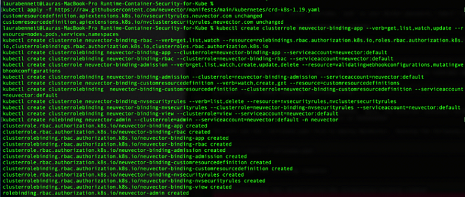

---
# Related publishing issue:

draft: true

title: Add runtime container security to your production Kubernetes workloads
subtitle: Learn how to integrate NeuVector with IBM Cloud container services
meta_title: Add runtime container security to your production Kubernetes workloads

authors:
  - name: Laura Bennett
    email: lbenn@us.ibm.com
  - name: Chris Rosen
    email: crosen@us.ibm.com

completed_date: "2021-03-09"
last_updated: "2021-03-09"
check_date: "2022-03-09"

excerpt: "Learn how to integrate NeuVector with IBM Cloud container services to provide complete runtime container security for your production Kubernetes workloads."
meta_description: "Integrate NeuVector with IBM Cloud container services to provide complete runtime container security for your production Kubernetes workloads."
meta_keywords: "Kubernetes container security, NeuVector and IBM Cloud"

primary_tag: cloud-ibm
tags:
  - containers
  - security
components:
  - kubernetes

related_content:
  - type: tutorials
    slug: building-docker-images-locally-and-in-cloud
  - type: series
    slug: kubernetes-learning-path

related_links:
  - title: NeuVector trial
    url: "https://go.neuvector.com/tryse"
  - title: Deploy NeuVector to Kubernetes
    url: "https://docs.neuvector.com:1594/deploying/kubernetes"  
  - title: "IBM Cloud Kubernetes Service"
    url: https://www.ibm.com/cloud/kubernetes-service?cm_mmc=OSocial_Blog-_-Cloud_Cloud+Platform-_-WW_WW-_-NeuVector&cm_mmca1=000023UA&cm_mmca2=10002833&

---
Containers technology makes it easy to deploy applications in the cloud and Kubernetes is one of the popular choices for deploying containerized applications. But in this new and ever-changing container and microservices world, container security is critical. Vulnerabilities in applications residing within a container can be exploited if the right protections are not in place. This tutorial demonstrates how [NeuVector](https://neuvector.com/) integrates with the [IBM Cloud Kubernetes Service](https://www.ibm.com/cloud/kubernetes-service?cm_mmc=OSocial_Blog-_-Cloud_Cloud+Platform-_-WW_WW-_-NeuVector&cm_mmca1=000023UA&cm_mmca2=10002833&) to provide complete runtime container security for your production Kubernetes workloads. We demonstrate how quickly and easily you can deploy a Kubernetes cluster in IBM Cloud and then secure those workloads by using NeuVector to monitor your containers for vulnerabilities.

NeuVector is a cloud-native container firewall for monitoring and protecting Kubernetes container deployments in production. (Read the [How to deploy a Docker container firewall](https://blog.neuvector.com/article/how-to-deploy-a-docker-container-firewall) article to learn how a container firewall differs from traditional next generation firewalls (NGFW) and web application firewalls (WAF).) In addition to Layer 7 network firewall protection of Kubernetes pods, the NeuVector security solution provides features for auditing your security settings with Docker Bench and the Center for Internet Security (CIS) Kubernetes Benchmark, as well as scanning containers for vulnerabilities. NeuVector also monitors host and container processes for suspicious activity such as privilege escalations, port scanning, reverse shells, and other unusual `syscall` activity.

The NeuVector solution is comprised of security containers which can be deployed on each node similar to how you deploy your applications using Kubernetes. For evaluation purposes, NeuVector makes an Allinone container and an Enforcer container available. These can be pulled from Docker Hub, along with documentation, by requesting access from info@neuvector.com.

## Prerequisites

To complete this tutorial, you will need the following environment:

* [IBM Cloud](https://cloud.ibm.com/registration/?cm_sp=ibmdev-_-developer-tutorials-_-cloudreg) account. **Note:** To create a free Kubernetes cluster to complete this tutorial, you must have a [Pay-As-You-Go or Subscription IBM Cloud account](https://www.ibm.com/cloud/pricing). Free clusters cannot be created in Lite accounts.
* [IBM Cloud Command Line Interface](https://cloud.ibm.com/docs/cli/) (CLI) tool.
* [IBM Cloud Kubernetes Service](https://cloud.ibm.com/docs/cli?topic=cli-install-devtools-manually#idt-install-kubernetes-cli-plugin) plug-in.

## Estimated time

After the [Prerequisites](#prerequisites) are met, completing this tutorial should take you approximately 30 minutes.

## Steps

1. [Create a Kubernetes cluster in IBM Cloud](#1-create-a-kubernetes-cluster-in-ibm-cloud)
2. [Deploy NeuVector onto your Kubernetes cluster](#2-deploy-neuvector-onto-your-Kubernetes-cluster)
3. [Generate test traffic by running sample applications](#3-generate-test-traffic-by-running-sample-applications)
4. [Log into the NeuVector console](#4-log-into-the-neuvector-console.)

### 1. Create a Kubernetes cluster in IBM Cloud

Log into your IBM Cloud account. Select **Kubernetes** from the Navigation Menu.

On the [Kubernetes Overview](https://cloud.ibm.com/kubernetes/overview/?cm_sp=ibmdev-_-developer-tutorials-_-cloudreg) page, select **Create a Cluster**.

**Note:** You will create a standard Kubernetes cluster in the following steps. However, you can still deploy NeuVector to a free cluster. If you choose the free version, you only have to set the **Cluster name** parameter within the **Resource details** section before you select **Create**. __(EDITOR NOTE: Why are you showing steps that will incur costs for the reader, especially when setting up a free cluster is simpler for demonstration purposes?)__

To create a standard cluster, set the following parameters:

* Select **Standard** from the list of pricing plans.

* Within the Kubernetes version list, select the current version of 1.19.8. __(EDITOR NOTE: 1.18.15 is no longer the [current version](https://cloud.ibm.com/docs/containers?topic=containers-cs_versions) as of February 16.)__

* From the **Infrastructure** options, choose **Classic**.

* In the **Location** section, keep the default options that are prefilled.

* In the **Worker pool** section, set up the number of worker nodes for your workload. This can be resized. Leave at default of 4. __(EDITOR NOTE: 3 workers appeared as my default. And at the end of this Step, your code says 2 workers.)__

* Within the **Resource details** section, enter a name for your cluster.

* In the **Summary** pane, review the order summary and then click **Create**.

  Worker nodes can take a few minutes to provision, but you can see the progress in the **Worker nodes** tab. When the status reaches `Ready`, you can start working with your cluster. See the [Getting started with IBM Cloud Kubernetes Service](https://cloud.ibm.com/docs/containers/cs_planning.html) documentation for more details about cluster creation.

You can also create a cluster from the command line __(EDITOR NOTE: Are you referring to the IBM Cloud CLI here or a local CLI on the reader's computer? For example, Terminal for Mac or Command Prompt for Windows. Personally, I use IBM Cloud Shell to test out tutorials.)__ by using the following command:

```
$ bx cs cluster-create -name -location -workers 2 -machine-type u1cx2x4 -hardware shared -public-vlan -private-vlan
```

### 2. Deploy NeuVector onto your Kubernetes cluster

Now that the environment is provisioned, you can access it from the IBM Cloud CLI tool that you downloaded in the [Prerequisites](#prerequisites).

First, go to the [Kubernetes clusters page](https://cloud.ibm.com/kubernetes/clusters) and click the name of the cluster that you created in [Step 1](#1-create-a-kubernetes-cluster-in-ibm-cloud).

On your cluster page, click **Access** from the menu and follow the **Accessing your cluster** instructions to log into your cluster from your local command line interface.

Enter the following command: __(EDITOR NOTE: Your readers already installed IBM Cloud CLI within the Prerequisites section. Would you prefer to remove it from the Prerequisites so they follow these instructions instead?)__

```
$ curl -sL https://ibm.biz/idt-installer | bash
```


1. Follow the instructions on the screen to:

  * Log into your cluster.
  * Set the Kubernetes context to your cluster.
  * Verify that you can connect to your cluster.

2. Create the namespace for NeuVector by entering the following command:

  ```
  kubectl create namespace neuvector
  ```

  You should get a response of `namepsace/neuvector created`.

3. Configure Kubernetes to pull from the private NeuVector registry on Docker Hub. You do this by creating a secret with the following command, where `<docker id>` is your Docker username, `<pwd>` is your Docker password, and `<email>` is your Docker email. __(EDITOR NOTE: Add a Docker account to the Prerequisites section.)__

  ```
  kubectl create secret docker-registry regsecret -n neuvector --docker-server=https://index.docker.io/v1/ --docker-username="<docker id>" --docker-password="<pwd>" --docker-email="<email>"
  ```
  You should get a response of `secret/regsecret created`.

  **Note:** Contact support@neuvector.com to request that your Docker Hub ID be added to the NeuVector private registry. __(EDITOR NOTE: Should this be added to the Prerequisites section? How long will it take for someone to receive a response and can they complete this tutorial while they wait or is it a blocker?)__

4. Create the custom resource definition (CRD) for the NeuVector security rules.

  For Kubernetes 1.19+, use the following command:

  ```
  kubectl apply -f https://raw.githubusercontent.com/neuvector/manifests/main/kubernetes/crd-k8s-1.19.yaml
  ```

  For Kubernetes 1.18+ and earlier, use the following command:

  ```
  kubectl apply -f https://raw.githubusercontent.com/neuvector/manifests/main/kubernetes/crd-k8s-1.16.yaml
  ```

  You will see the following results:

  

5. Add read permission to access the kubernetes API. RBAC is supported in kubernetes 1.8+ officially. Admission control is supported in kubernetes 1.9+

  ```
  kubectl create clusterrole neuvector-binding-app --verb=get,list,watch,update --resource=nodes,pods,services,namespaces
  kubectl create clusterrole neuvector-binding-rbac --verb=get,list,watch --resource=rolebindings.rbac.authorization.k8s.io,roles.rbac.authorization.k8s.io,clusterrolebindings.rbac.authorization.k8s.io,clusterroles.rbac.authorization.k8s.io
  kubectl create clusterrolebinding neuvector-binding-app --clusterrole=neuvector-binding-app --serviceaccount=neuvector:default
  kubectl create clusterrolebinding neuvector-binding-rbac --clusterrole=neuvector-binding-rbac --serviceaccount=neuvector:default
  kubectl create clusterrole neuvector-binding-admission --verb=get,list,watch,create,update,delete --resource=validatingwebhookconfigurations,mutatingwebhookconfigurations
  kubectl create clusterrolebinding neuvector-binding-admission --clusterrole=neuvector-binding-admission --serviceaccount=neuvector:default
  kubectl create clusterrole neuvector-binding-customresourcedefinition --verb=watch,create,get --resource=customresourcedefinitions
  kubectl create clusterrolebinding  neuvector-binding-customresourcedefinition --clusterrole=neuvector-binding-customresourcedefinition --serviceaccount=neuvector:default
  kubectl create clusterrole neuvector-binding-nvsecurityrules --verb=list,delete --resource=nvsecurityrules,nvclustersecurityrules
  kubectl create clusterrolebinding neuvector-binding-nvsecurityrules --clusterrole=neuvector-binding-nvsecurityrules --serviceaccount=neuvector:default
  kubectl create clusterrolebinding neuvector-binding-view --clusterrole=view --serviceaccount=neuvector:default
  kubectl create rolebinding neuvector-admin --clusterrole=admin --serviceaccount=neuvector:default -n neuvector
  ```

  You will see the following results:

  


  **NOTE** If you are upgrading NeuVector from a previous install, you may need to delete the old binding as follows:

  ```
  kubectl delete clusterrolebinding neuvector-binding
  kubectl delete clusterrole neuvector-binding
  ```

6. Run the following commands to check if the neuvector/default service account is added successfully

  ```
  kubectl get clusterrolebinding  | grep neuvector
  kubectl get rolebinding -n neuvector | grep neuvector
  ```

  Sample output:

  ```
  neuvector-binding-admission                            28d
  neuvector-binding-app                                  28d
  neuvector-binding-customresourcedefinition             28d
  neuvector-binding-nvsecurityrules                      28d
  neuvector-binding-rbac                                 28d
  neuvector-binding-view                                 28d
  neuvector-admin   28d
  ```

7. Create the NeuVector services and pods from the Kubernetes sample YAML located in the same directory as the `README` file.

  **Important note:** If you want to use another version for the NeuVector's manager, controller, and enforcer images, replace the `<version>` tags in the YAML file. The current version is 4.1.1. Also make any other modifications required for your deployment environment. Note that since this tutorial is using the IBM Cloud Kubernetes Service, we are using `containerd` for Nevector's controller and enforcer pods in the YAML file.

  ```
  kubectl create -f neuvector.yaml
  ```

  You can verify that your pods are available and running by using the following command:

  ```
  kubectl get pod -n neuvector
  ```

  You will see results similar to the ones in the following screen capture image:

  

  You can also verify your services are running by running the following command:

  ```
  kubectl get svc -n neuvector
  ```

  You will see results similar to the ones in the following screen capture image:

  

  If you receive any errors, refer to the [Troubleshooting](#troubleshooting) section later in this tutorial.

  You should be able to connect to the NeuVector console and log in with `admin:admin`. For example, `https://<public-ip>:8443`. Don't forget to apply your license file after logging in so that you can see all Nodes, Enforcers, and Assets.

  **Note:** The `nodeport` service specified in the `neuvector.yaml` file will open a random port on all Kubernetes nodes for the NeuVector management web console port. Alternatively, you can use a LoadBalancer or Ingress, using a public IP and default port 8443. For `nodeport`, be sure to open access through firewalls for that port if necessary. If you want to see which port is open on the host nodes, run the following commands. __(EDITOR NOTE: What are the commands that the reader should run in this situation? They are missing.)__

### 3. Generate test traffic by running sample applications

If you have not already deployed some sample applications, now is a good time to do that so that you'll be able to see application containers running and view their connections in NeuVector.

After generating test traffic through your sample apps, log into the NeuVector console.

### 4. Log into the NeuVector console

Since the `webui` is defined in the `.yaml` file as type `NodePort`, and IBM Cloud Kubernetes Service is using `containerd`, you must access an external port.

You can identify the external IP address of the NeuVector service deployed on your cluster by running the following command:

```
kubectl get nodes -o wide
```

The following screen capture image shows an example of the output:


You can then access the NeuVector console in a browser and log in with `admi:admin` using the following command:

```
https://169.51.195.48:32340
```

* `IP Addr:` was pulled from the previous `get nodes` command.
* `Port:` was pulled from the `get pod` command run in [Step 2](#2-deploy-neuvector-onto-your-kubernetes-cluster), task 7. Choose the port associated with the `webui` pod.

You will see a login screen such as the one in the following screen capture image.


If you have not yet received a temporary license for using the NeuVector console, go to [Red Hat Marketplace](https://marketplace.redhat.com/en-us/products/neuvector-operator) and request a free trial. This will give you a license to access the console.

Once you log in, you should see the NeuVector console.


Feel free to browse the console. View network activity, policy rules, and other resources. To learn more about the using the console, see the [NeuVector Solution Overview](https://neuvector.com/videos/neuvector-solution-overview/) video.

## Troubleshooting

* If you observe errors after running the `get pod` or `get svc` commands, you can try to dig deeper and find out whether there are errors when you run the following command:

  ```
  kubectl describe pod <pod Name>  -n neuvector
  ```

* If the `'kubectl replace -f neuvector.yaml'` command does not work, you can edit and force Kubernetes to re-read the `.yaml` file to update a specific pod configuration (such as image version) by running the following command (this example shows an update to the `webui` pod):

  ```
  kubectl edit svc neuvector-service-webui -n neuvector
  ```

* Sometimes, unexplainable errors occur with the pod. Ensure that you still have your secret established. You can verify it by using the following command:

  ```
  get secret regsecret -n neuvector --output="jsonpath={.data.\.dockerconfigjson}" | base64 --d -
  ```

## Summary

The IBM Cloud Kubernetes Service makes it easy to set up a Kubernetes cluster to host your containerized applications. When running such applications in production, security is required to ensure that the applications are safe and communicating properly. NeuVector provides that runtime security in any cloud environment, providing a Layer 7 firewall, host and container processes monitoring, and vulnerability scanning solution. You can request a demo and access to the download by contacting NeuVector at info@neuvector.com.
